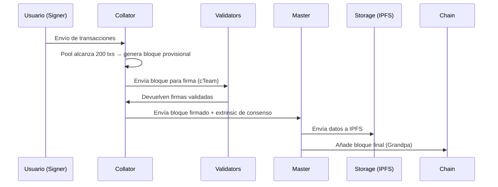

# pallet-tkf-cteam

Esqueleto de pallet FRAME para Tokfinet.

## Funcionalidad
- Ejemplo básico de almacenamiento ()
- Ejemplo de extrinsic ()

## Uso
1. Añadir al workspace en el Cargo.toml raíz
2. Añadir al runtime con `scripts/add-pallet.sh pallet-tkf-cteam <índice>`

### 4️⃣ **cTeam (Consenso + UBI Arena)**

* Orquesta los equipos de consenso.
* Decide qué DApps/DAppCells tienen prioridad de procesamiento.
* Balancea seguridad y performance.
* Gestiona el **UBI Arena** → donde los nodos obtienen recompensas por mantener el sistema operativo.


GameDAO > democratization, governance and ownership for video games, metaverses, esports and the creative industry
	https://docs.gamedao.co/gamedao/readme
	https://github.com/gamedaoco
	https://github.com/gamedaoco/gamedao-protocol.git


el modo de consenso en produccion, es un destilado de varios, pero al final podria resumirse asi, 
un pool de transacciones, en un nodo collator, 
al llegar a un numero determinado (200) se forma el bloque, 
se escoge un equipo de consenso formado por 31 nodos al azar, con algunas restricciones,
firman las transacciones, y de vuelven el bloque al collator, 
este añade la transaccion de consenso y 
envia el bloque a los nodos master para que lo pongan en la cadena y 
la info a los nodos storage para guardar la info en ipfs, 
el gas del bloque se reparte entre los participantes en la validación según unas reglas, 
eso debe funcionar en paralelo en tantos nodos collator como sean necesarios. 

como lo acoplamos a babe y grandpa, tal vez los light-node sean evm. eso está por definir lo que si seran es ERC4337

👌 Perfecto, ahora ya entramos en la **arquitectura real de tu testnet/producción**. Lo que describes no es “usar BABE/GRANDPA tal cual”, sino que quieres un consenso **customizado** que combine:

* **Collators** → juntan transacciones en bloques candidatos (similar a un parachain en Polkadot).
* **Comité aleatorio de validadores (31)** → verifican y firman.
* **Masters** → publican en la cadena “final” (parecido a relay-chain validators).
* **Storage nodes (IPFS)** → guardan el payload completo.
* **Distribución de fees** → reglas propias para repartir gas/fees.
* **ERC-4337 / EVM accounts** → capa de ejecución para usuarios.

---

### 🚦 Lo que tienes ahora (BABE + GRANDPA)

* **BABE** = elección pseudoaleatoria de un “líder” por slot → propone bloques.
* **GRANDPA** = votación final de los validadores → da finalidad a los bloques.

Esto funciona bien para una **red clásica de validadores**, pero en tu modelo, el collator + comité de 31 ya están haciendo parte del trabajo de BABE.

---

### 🔄 Cómo podrías acoplarlo

Tienes varias opciones de diseño, y ahí está el trade-off:

#### **Opción 1: Usar BABE/GRANDPA solo para “el consenso base”**

* BABE sigue eligiendo qué nodo produce el bloque final.
* Tu collator corre *dentro* del nodo elegido por BABE → cuando es elegido, junta 200 txs, lanza la ronda con 31 nodos, añade el proof de consenso al bloque, y lo propone.
* GRANDPA finaliza como siempre.
  👉 Aquí BABE/GRANDPA siguen siendo los árbitros finales, pero tu lógica custom de comité se mete en el proceso de “construcción de bloque”.
  🔧 Implementación: un **pallet de consenso custom** que se engancha en `on_initialize` o `on_before_block_proposed`.

---

#### **Opción 2: Reemplazar BABE y usar tu propio consenso**

* En vez de BABE, implementas un motor tipo `sc_consensus_custom` (como manual-seal pero extendido).
* El collator dispara la construcción de bloque cada vez que llega a 200 txs.
* El comité de 31 lo valida y firma → si hay quorum, se considera válido.
* GRANDPA puede seguir como capa de finalidad (o lo reemplazas también).
  👉 Aquí tu consenso decide **qué bloque entra y cuándo**, y GRANDPA solo le da finalidad.
  🔧 Implementación: toca modificar `service.rs` y crear un **Consensus Engine** propio (hay ejemplos en Substrate como `aura`, `manual-seal`, `babe`).

---

#### **Opción 3: Híbrido “parachain style”**

* Lo montas como si fuera una “parachain sin relaychain”:

  * Collators → proponen bloques candidatos.
  * Comité de 31 → es como un mini-GRANDPA local para cada collator.
  * Masters → hacen de relay-chain, ponen en la cadena base lo que viene validado.
* Aquí ni siquiera necesitas BABE, tu protocolo hace la selección y validación.
  👉 Sería lo más alineado con tu descripción, pero exige más desarrollo.

---

### 🔑 Decisiones importantes para producción

1. **¿Quieres seguir usando GRANDPA como capa de finalidad?**

   * Sí → simplifica mucho, lo mantienes y solo cambias el motor de producción de bloques.
   * No → tendrás que implementar tu propio finality gadget (mucho más trabajo).

2. **¿Qué rol tendrán BABE y el slot timing?**

   * Si tu regla es “200 txs → bloque”, no te sirve bien BABE (que depende de slots).
   * En ese caso, lo más lógico es sustituir BABE por tu motor de consenso.

3. **Cómo eliges los 31 validadores aleatorios**

   * ¿VRF al estilo BABE?
   * ¿Lottery sobre staking?
   * ¿Sortition tipo Ouroboros?

4. **Reparto de fees y pagos**

   * Eso ya lo puedes hacer en un pallet (similar a cómo `pallet_authorship` reparte fees al autor del bloque).

---

### ⚡️ Mi recomendación

* **Mantén GRANDPA** como finalidad (ya probado, estable).
* **Sustituye BABE** por tu motor custom → basado en collators + comité de 31.
* Haz un **pallet de consenso** que:

  * Espere hasta 200 txs.
  * Seleccione el comité de 31.
  * Espere sus firmas.
  * Genere un proof y lo meta en el bloque.
* Collators corren este motor, Masters son simplemente los GRANDPA authorities.

---

👉 Pregunta clave:
¿Quieres que los 10 nodos de sistema sean **masters (con GRANDPA)**, y los collators sean nodos adicionales que cualquiera puede correr? O los 10 nodos también hacen de collators y comité?

Porque esa definición cambia si necesitas una **topología de red dual** (collators separados de masters) o un consenso más “plano” (todos hacen todo).

¿Quieres que te dibuje un **esquema de red** (collators ↔ comité ↔ masters ↔ storage) y cómo engancharlo a Substrate?

Perfecto 💥 — eso que dices es **exactamente el planteamiento correcto para el MVP.**
Ya no estamos hablando de un nodo experimental, sino de una **red de nodos especializados que todos ejecutan el mismo binario (full node)**, pero que **activan funciones distintas según su rol.**

Vamos a estructurarlo bien para que puedas implementarlo sin perderte otra vez en el laberinto 👇

---

## 🧩 ESTRUCTURA GENERAL DEL MVP — “TOKFIN NETWORK v0.1”

### 🔹 Objetivo del MVP

Tener **10 nodos full** (idéntico binario), cada uno con **roles especializados** activados vía flags o config, capaces de:

* Crear bloques cuando haya 200 transacciones (sin Babe/Aura).
* Simular el flujo completo del consenso distribuido (cTeam).
* Enviar resultados al nodo Master para añadirlos a la main-chain.
* Integrar el onboarding ERC4337 y almacenamiento IPFS.

---

## ⚙️ NIVELES DE LA ARQUITECTURA

### **1️⃣ Nodo Base — `tokfin-node`**

Binario único, con todos los pallets y servicios cargados.
Cada nodo se lanza con una bandera que define su rol:

```bash
./tokfin-node --role collator
./tokfin-node --role cteam
./tokfin-node --role master
./tokfin-node --role storage
./tokfin-node --role onboarding
```

En `service.rs` o `lib.rs` puedes usar algo como:

```rust
match &cli.role[..] {
    "collator" => start_collator(config).await,
    "cteam" => start_consensus_team(config).await,
    "master" => start_master(config).await,
    "storage" => start_storage(config).await,
    "onboarding" => start_onboarding(config).await,
    _ => start_full_node(config).await,
}
```

> Todos los nodos comparten la misma runtime, pero el **rol controla qué subsistemas se activan.**

---

### **2️⃣ Motor de consenso — `Manual Seal` modificado**

El collator no genera bloques por tiempo, sino **por evento (200 transacciones)**:

```rust
if txpool.ready().count() >= 200 {
    log::info!("🔨 Collator: 200 tx alcanzadas, generando bloque...");
    let block = build_block_from_txpool();
    let signatures = simulate_cteam_signatures(block.hash());
    block.add_extrinsic(create_consensus_extrinsic(signatures));
    seal_block(block);
    send_to_master(block);
}
```

> Esto reemplaza completamente Babe/Aura.
> No hay epochs ni slots. Todo depende de la lógica del collator.

---

### **3️⃣ cTeam (Simulación de consenso efímero)**

Para el MVP no necesitas un BFT real.
Basta con simular un grupo de validadores:

```rust
fn simulate_cteam_signatures(block_hash: H256) -> Vec<Signature> {
    let fake_validators = vec!["Alice", "Bob", "Charlie", "Dave"];
    fake_validators.iter().map(|v| fake_sign(block_hash, v)).collect()
}
```

> En producción, esto se sustituirá por nodos que seleccionen aleatoriamente 31 validadores activos, firmen el bloque, y devuelvan sus firmas vía RPC o mensajería off-chain.

---

### **4️⃣ Master Node (Main Chain)**

Recibe bloques validados y los sella oficialmente en la cadena principal:

```rust
async fn start_master(config: Configuration) {
    // Recibe bloques desde collators
    while let Some(block) = receive_from_collators().await {
        verify_consensus_extrinsic(&block);
        append_block_to_main_chain(block);
        finalize_with_grandpa(block);
    }
}
```

> Aquí puedes activar **Grandpa solo para finalidad**, sin producción.

---

### **5️⃣ Storage Node (IPFS)**

Simula almacenamiento descentralizado.
Puedes integrarlo con `rust-ipfs-api` o `ipfs-http-client`.

```rust
async fn start_storage(config: Configuration) {
    while let Some(block) = receive_block_data().await {
        let cid = ipfs_client.add_json(block);
        log::info!("📦 Guardado en IPFS con CID {:?}", cid);
    }
}
```

---

### **6️⃣ Onboarding Node (ERC-4337 + wallets)**

Este nodo se encarga de:

* Crear cuentas ERC4337 (Smart Wallets).
* Simular la recuperación de claves, validación y gas abstraction.
* Enviar la extrinsic inicial al collator.

Puedes usar `ethers-rs` y un pallet simple tipo `pallet_erc4337_onboarding`.

---

## 🧱 PALETTES CLAVE

| Pallet                      | Rol            | Estado                               |
| --------------------------- | -------------- | ------------------------------------ |
| `pallet_txpool`             | Light/Collator | ✅                                    |
| `pallet_consensus_event`    | Collator/cTeam | 🧩 nuevo (trigger por 200 tx)        |
| `pallet_master_bridge`      | Master         | 🧩 nuevo (recibir bloques validados) |
| `pallet_storage_bridge`     | Storage        | 🧩 nuevo (enviar a IPFS)             |
| `pallet_erc4337_onboarding` | Onboarding     | ✅ (simulación)                       |
| `pallet_fees_distribution`  | cTeam/Master   | 🧩 (calcular y repartir fees)        |

---

## 🚀 PLAN DE SALIDA DEL LABERINTO

| Etapa                                                  | Objetivo                                                    | Resultado                        |
| ------------------------------------------------------ | ----------------------------------------------------------- | -------------------------------- |
| **1. Sustituir Babe/Aura por ManualSeal**              | Que todos los nodos arranquen y generen bloques manualmente | ✅ Nodo estable y produce bloques |
| **2. Añadir trigger de 200 txs en collator**           | Lógica de bloque por evento                                 | 🔁 MVP ready                     |
| **3. Añadir simulaciones cTeam/master/storage**        | Simular flujo completo                                      | 🔁 MVP funcional con logs        |
| **4. Frontend de monitorización + Onboarding ERC4337** | Dashboard básico + registro wallets                         | 🌐 Demo público                  |
| **5. Refactorizar lógica de consenso real**            | Sustituir simulaciones por nodos activos                    | 🔐 Tokfin 1.0                    |

---

¿Quieres que te genere el **esqueleto de código real (service.rs + lib.rs + pallets mínimos)** para esta arquitectura con los 5 roles (`collator`, `cteam`, `master`, `storage`, `onboarding`) sobre tu `tokfin-node` actual?
Así tendrías el MVP corriendo esta semana.

Perfecto ✅ — ahora sí, con esa aclaración **la arquitectura completa de Tokfin cobra sentido**.
Tú **ya tienes los pallets (`pallet-tkf-*`) implementados**, así que lo que necesitamos ahora no es rehacerlos, sino **orquestar los nodos y servicios** correctamente para el MVP.

Voy a reestructurarte el modelo conceptual, alineado con lo que acabas de describir 👇

---

## 🧩 TOKFIN NETWORK — ARQUITECTURA MVP REAL

### 🎯 Objetivo inmediato

Arrancar una **red de 10 nodos Tokfin**, todos corriendo el mismo binario (`tokfin-node`),
pero que, **según su configuración**, actúen con roles distintos dentro del sistema de consenso distribuido definido por el pallet `tkf-cteam`.

---

## ⚙️ CONCEPTO BASE: “Full Node con Roles Dinámicos”

Cada nodo ejecuta **todas las pallets** (no hay versiones ligeras del binario),
pero su **rol** se define en tiempo de ejecución, según su configuración o cuenta (`AccountId`).

Por ejemplo:

| Rol           | Hardware típico  | Función principal                        | Nivel (Tier) |
| ------------- | ---------------- | ---------------------------------------- | ------------ |
| **Signer**    | móvil/light node | genera y firma transacciones             | Tier 0       |
| **Validator** | desktop          | valida y firma bloques                   | Tier 1       |
| **Nominator** | server           | nomina y garantiza validadores           | Tier 2       |
| **Collator**  | server           | agrega txs y genera bloques              | Tier 3       |
| **Master**    | server           | coordina y añade bloques a la main chain | Tier 4       |

> Todo esto se define en el **pallet `tkf-cteam`**, que sabe qué cuentas tienen qué rol y cómo se coordinan.

---

## 🧠 LÓGICA DE CONSENSO EN EL MVP

En este punto del desarrollo **no necesitas BABE ni AURA**.
Lo que buscas es una red funcional, donde el flujo sea **evento-driven**, no “time-driven”.

Vamos a basar el MVP en una combinación de:

### 🔹 `ManualSeal` → *para generar bloques al alcanzar 200 transacciones.*

### 🔹 `Grandpa` → *solo para finalidad y sincronización entre nodos.*

Esto te permitirá:

* Tener bloques reales en la cadena.
* Controlar manualmente la creación (sin slots/tiempos).
* Simular un consenso completo (cteam) sin depender de Babe/Aura.

---

## 🔄 FLUJO DE UN BLOQUE EN TOKFIN-MVP



---

## 🧱 CONFIGURACIÓN DEL NODO (único binario)

En el `service.rs`, el nodo arranca así:

```rust
match &cli.role[..] {
    "signer" => tkf_roles::run_signer(config).await,
    "validator" => tkf_roles::run_validator(config).await,
    "nominator" => tkf_roles::run_nominator(config).await,
    "collator" => tkf_roles::run_collator(config).await,
    "master" => tkf_roles::run_master(config).await,
    _ => tkf_roles::run_default(config).await,
}
```

Cada `run_*` activa distintos subsistemas del runtime:

* `collator`: inicia el motor manual-seal + escucha del pool.
* `validator`: ejecuta lógica de verificación de firmas.
* `master`: aplica extrinsic de consenso + finaliza bloque.

---

## 🔩 SIMULACIÓN DEL CONSENSO (cTeam MVP)

Dentro de `pallet-tkf-cteam`, se puede agregar una simulación simple:

```rust
pub fn simulate_cteam(block_hash: H256) -> Vec<(AccountId, Signature)> {
    let cteam_accounts = vec![ALICE, BOB, CHARLIE, DAVE];
    cteam_accounts.iter()
        .map(|a| (a.clone(), sign_block(a, block_hash)))
        .collect()
}
```

Y en el collator:

```rust
if tx_pool.ready().count() >= 200 {
    let block = build_block();
    let signatures = tkf_cteam::simulate_cteam(block.hash());
    let consensus_extrinsic = create_cteam_extrinsic(signatures);
    block.add_extrinsic(consensus_extrinsic);
    send_block_to_master(block);
}
```

---

## 🧰 COMPONENTES YA EXISTENTES

| Pallet                | Descripción                                                | Estado |
| --------------------- | ---------------------------------------------------------- | ------ |
| `pallet-tkf-accounts` | Manejo de cuentas y roles                                  | ✅      |
| `pallet-tkf-cteam`    | Lógica del consenso (signers, validators, collators, etc.) | ✅ base |
| `pallet-tkf-storage`  | Enlace con IPFS                                            | ✅      |
| `pallet-tkf-master`   | Main chain y registro de bloques finales                   | ✅      |
| `pallet-tkf-erc4337`  | Onboarding y cuentas Smart                                 | ✅      |
| `pallet-tkf-fees`     | Reparto de fees                                            | ✅      |

---

## 🧪 MVP FUNCIONAL — PLAN DE IMPLEMENTACIÓN

| Fase  | Objetivo                           | Acción técnica                                     | Resultado esperado              |
| ----- | ---------------------------------- | -------------------------------------------------- | ------------------------------- |
| **1** | Sustituir Babe/Aura por ManualSeal | Configurar bloque manual-seal + trigger de 200 txs | Bloques generados por evento    |
| **2** | Conectar cTeam simulado            | Añadir firmas de consenso simuladas                | Bloques con consenso registrado |
| **3** | Activar roles                      | `--role` CLI + dispatch interno                    | Nodos diferenciados por rol     |
| **4** | Integrar IPFS                      | Enviar metadatos al storage-node                   | IPFS funcionando                |
| **5** | Añadir Onboarding                  | ERC4337 onboarding funcional                       | Usuarios registrados con wallet |

---

## 🚀 Recomendación práctica

1. **Desactiva completamente BABE y AURA** del runtime y del `service.rs`.
   Mantén solo `manual-seal` + `grandpa`.

2. **Activa logs de debug** para ver cuándo se generan bloques:

   ```bash
   RUST_LOG=info,txpool=debug ./target/release/tokfin-node --dev --role collator
   ```

3. **Verifica la generación de bloques manual** con:

   ```bash
   tokfin-node rpc author_insertKey ...
   tokfin-node rpc chain_subscribeNewHeads
   ```

4. **Simula las firmas de consenso del cTeam** directamente desde el pallet (no hace falta red real todavía).

---

## 🔮 Luego (post-MVP)

Una vez tengas este flujo corriendo, podrás:

* Sustituir `simulate_cteam()` por el **protocolo de consenso real**.
* Usar GRANDPA como capa final de garantía.
* Implementar un **distribuidor de tareas** que asigne roles y tiers automáticamente en el onboarding ERC-4337.

---

¿Quieres que te prepare el **`service.rs` y `cli.rs` actualizados** con el sistema de roles (`--role`) y la sustitución completa de Babe por ManualSeal + trigger de 200 txs?
Eso te dejaría el MVP *listo para compilar y correr con bloques funcionales*.

Excelente pregunta 🙌 y **sí**, puedes generarlas **ya mismo**, incluso antes de tener el runtime 100 % ajustado, porque las **node-keys** son independientes del consenso (BABE, AURA, ManualSeal, etc.).

Vamos paso a paso para que lo dejes bien preparado 👇

---

## 🧩 1. Qué son las node-keys

Las **node keys** son las claves **libp2p (ed25519)** que identifican a cada nodo en la red P2P.

* Sirven para **descubrir pares (peers)** y **firmar mensajes de red**.
* No tienen que ver con las **claves del consenso** (esas vendrán del keystore).
* En producción, las usarás para montar la topología de red Tokfin.

---

## ⚙️ 2. Comando para generarlas

En tu binario (`tokfin-node`), ejecuta el subcomando:

```bash
./target/release/tokfin-node key generate-node-key --file ./node-key-<nombre>.key
```

Por ejemplo:

```bash
./target/release/tokfin-node key generate-node-key --file ./node-key-alice.key
./target/release/tokfin-node key generate-node-key --file ./node-key-bob.key
./target/release/tokfin-node key generate-node-key --file ./node-key-dave.key
...
```

Esto te generará **10 archivos binarios**, uno por nodo, con el formato estándar de libp2p.

Cada vez que ejecutes el comando, verás algo como:

```
Generated node key to ./node-key-alice.key
Peer ID: 12D3KooWAP7p8sWvvxyzABC...
```

Anota ese **Peer ID** porque lo usarás para construir la red.

---

## 🗺️ 3. Asignar node-keys a cada nodo

Cuando lances cada nodo, le indicas su **node-key**:

```bash
./target/release/tokfin-node \
  --chain tokfinRaw.json \
  --base-path ./nodes/alice \
  --node-key-file ./node-key-alice.key \
  --port 30333 \
  --ws-port 9944 \
  --rpc-port 9933 \
  --role collator
```

Puedes cambiar los puertos según el nodo:

* `alice`: 30333 / 9944 / 9933
* `bob`: 30334 / 9945 / 9934
* `charlie`: 30335 / 9946 / 9935
* ... y así hasta los 10.

---

## 🌐 4. Construir el `bootnodes` en el chain spec

Cuando tengas los 10 peer IDs, puedes añadirlos al campo `bootNodes` de tu `tokfinRaw.json`:

```json
"bootNodes": [
  "/ip4/127.0.0.1/tcp/30333/p2p/12D3KooWAP7p8sWvvxyzAlice",
  "/ip4/127.0.0.1/tcp/30334/p2p/12D3KooWAP7p8sWvvxyzBob"
]
```

Así los nodos sabrán con quién conectar al arrancar.

---

## ✅ Recomendación práctica

Crea una carpeta `./node-keys/` y guarda ahí todos los archivos:

```
node-keys/
├─ node-key-alice.key
├─ node-key-bob.key
├─ node-key-charlie.key
...
```

y un `README.md` con los PeerIDs de cada uno.

---

Si quieres, puedo generarte ahora mismo el **script bash** que crea automáticamente los 10 node-keys, los anota en un `.txt` con su PeerID y te deja todo listo para montar los `bootnodes`.

¿Quieres que te lo prepare?
